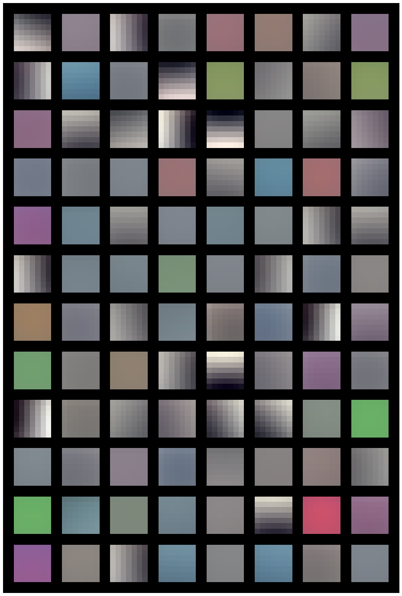
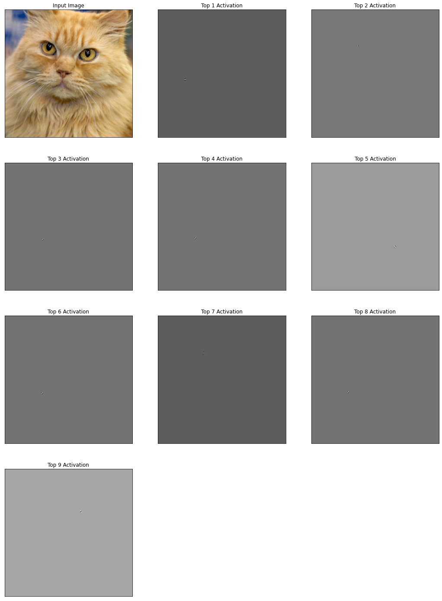
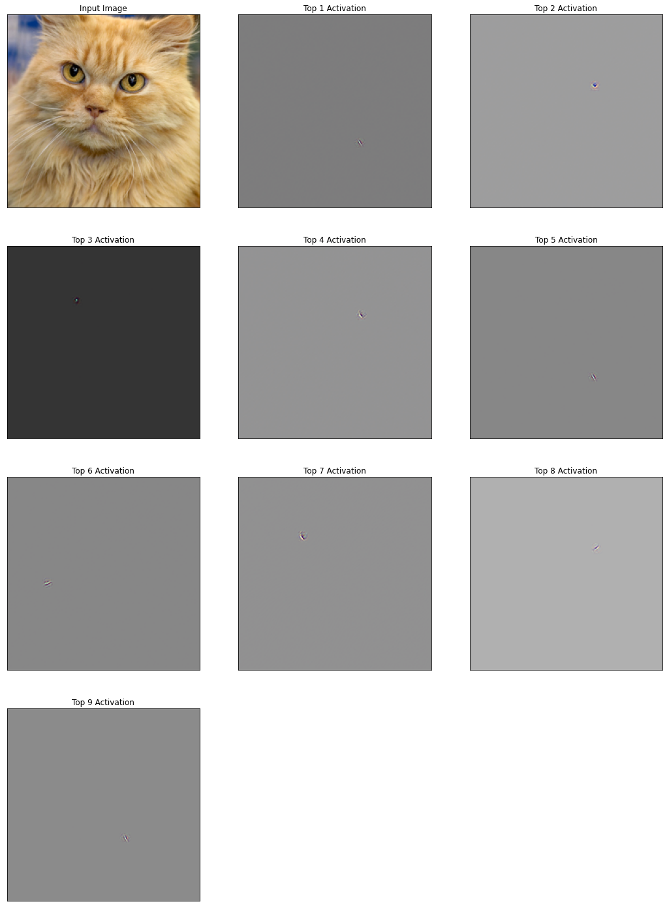
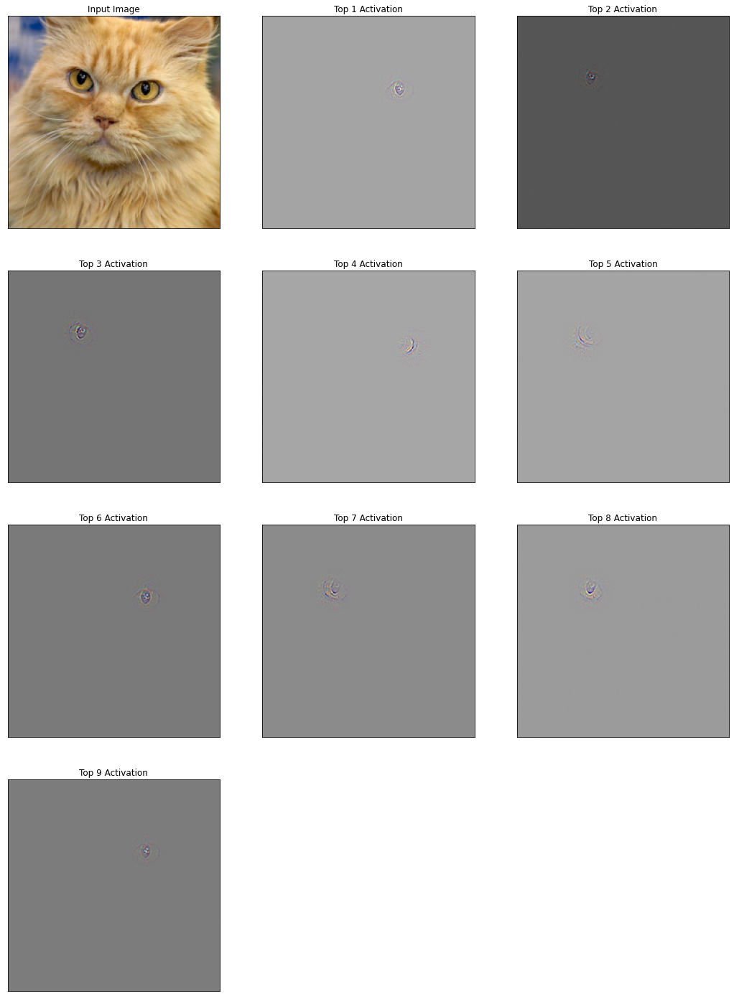
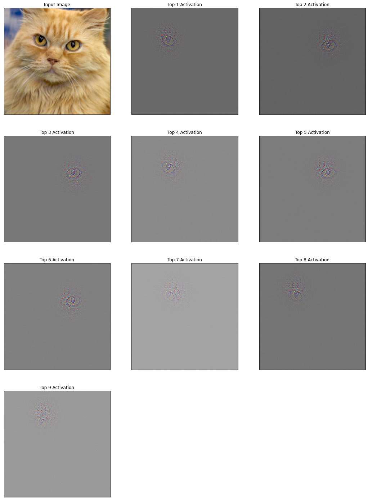
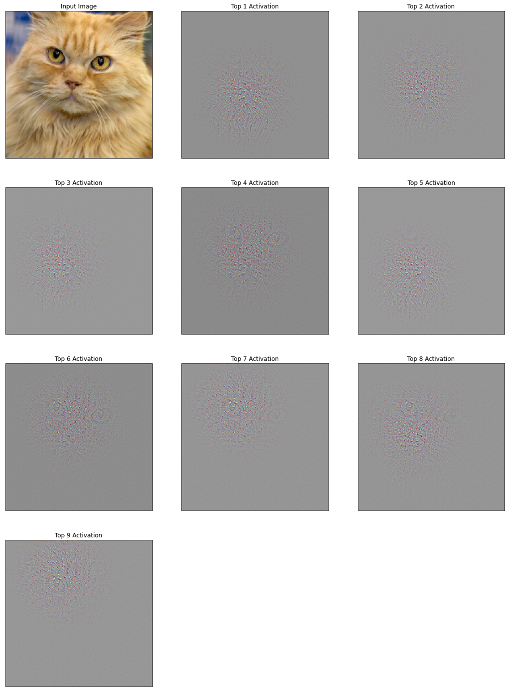
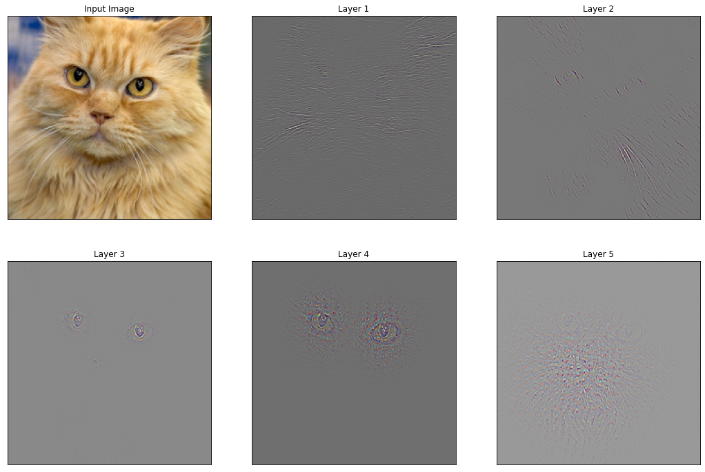

# ZFNet Implementation with Pytorch
- Unofficial Pytorch implementation of the paper *Visualizing and Understanding Convolutional Networks*


## 0. Develop Environment
```
Docker Image
- pytorch/pytorch:1.8.1-cuda11.1-cudnn8-devel
```


## 1. Implementation Details
- model.py : ZFNet model
- train.py : train ZFNet
- utils.py : count correct prediction
- ZFNet - Cifar 10.ipynb : install library, download dataset, preprocessing, train and result
- Visualize - ZFNet, Layer 1, No Deconvolution : visualize ZFNet layer 1
- Visualize - VGG19, Layer 1, No Deconvolution : visualize VGG19 layer 1
- Visualize - VGG19, Layer 1, Top 9, Pixel : visualize VGG19 layer 1 using deconvolution and unpooling of top 9 pixel activations
- Visualize - VGG19, Layer 2, Top 9, Pixel : visualize VGG19 layer 2 using deconvolution and unpooling of top 9 pixel activations
- Visualize - VGG19, Layer 3, Top 9, Pixel : visualize VGG19 layer 3 using deconvolution and unpooling of top 9 pixel activations
- Visualize - VGG19, Layer 4, Top 9, Pixel : visualize VGG19 layer 4 using deconvolution and unpooling of top 9 pixel activations
- Visualize - VGG19, Layer 5, Top 9, Pixel : visualize VGG19 layer 5 using deconvolution and unpooling of top 9 pixel activations
- Visualize - VGG19, Layers, Top 1, Channel : visualize VGG19 layers using deconvolution and unpooling of top 1 channel activations
- Details
  * Follow the paper train details : batch size 128, lr 0.01, momentum 0.9
  * No learning rate scheduler for convenience
  * Use kaiming normalization for initializing weight parameters of convolution layers
  * Use CIFAR 10 statistics for image pre-processing
  * ZFNet trained on CIFAR 10 are not effective for visualization, so use VGG19 models pre-trained on ImageNet


## 2. Results
#### 2.1. ZFNet Layer 1


#### 2.2. VGG19 Layer 1 - Top 9 Pixel Activations Deconvolution


#### 2.3. VGG19 Layer 2 - Top 9 Pixel Activations Deconvolution


#### 2.4. VGG19 Layer 3 - Top 9 Pixel Activations Deconvolution


#### 2.5. VGG19 Layer 4 - Top 9 Pixel Activations Deconvolution


#### 2.6. VGG19 Layer 5 - Top 9 Pixel Activations Deconvolution


#### 2.7. VGG19 Layers - Top 1 Channel Activations Deconvolution



## 3. Reference
- Visualizing and Understanding Convolutional Networks [[paper]](https://arxiv.org/pdf/1311.2901.pdf)
